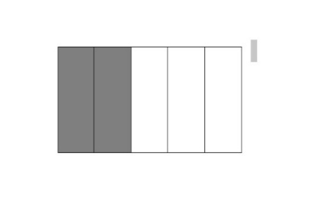

## 1. Pilihan Ganda

Hasil dari 12.352 + 4.673 adalah ....

- A. 16.925
- B. 17.235
- C. 18.355
- D. 17025

Kunci: D
Skor: 1

## 2. Pilihan Ganda

Hasil dari 17.687 – 9.735 adalah ....

- A. 7.952
- B. 7.529
- C. 7.295
- D. 9.275

Kunci: A
Skor: 1

## 3. Pilihan Ganda

21.123, 21.032, 21.029, 21.119, 21.141
Bilangan di atas yang paling kecil adalah ....

- A. 21.123
- B. 21.029
- C. 21.141
- D. 21.032

Kunci: B
Skor: 1

## 4. Pilihan Ganda

Selisih nilai angka 5 dan 6 pada bilangan 5.6385 adalah ....

- A. 1.000
- B. 2.500
- C. 4.400
- D. 5.400

Kunci: C
Skor: 1

## 5. Pilihan Ganda

Ibu memotong kue menjadi 4 bagian sama besar. Satu bagian diberikan kepada Wida. Wida mendapatkan ... bagian kue.

- A. 1/2
- B. 1/3
- C. 2/4
- D. 1/4

Kunci: D
Skor: 1

## 6. Pilihan Ganda

1/2 ......... 1/3
Tanda pembanding yang tepat untuk mengisi titik-titik di atas adalah ....

- A. <
- B. >
- C. ^
- D. =

Kunci: B
Skor: 1

## 7. Pilihan Ganda

Nilai pecahan yang diarsir pada gambar di bawah adalah ....

- A. 1/5
- B. 2/5
- C. 3/5
- D. 4/5

Kunci: B
Skor: 1

## 8. Pilihan Ganda

Perkalian 6 x 9 = 54 jika diubah menjadi operasi pembagian menjadi....

- A. 6 : 9 = 54
- B. 9 : 6 = 54
- C. 54 : 6 = 9
- D. 54 : 9 = 9

Kunci: C
Skor: 1

## 9. Pilihan Ganda

Hasil dari 15 x 25 = ....

- A. 537
- B. 735
- C. 357
- D. 375

Kunci: D
Skor: 1

## 10. Pilihan Ganda

Azkia sangat menyukai boneka panda. Ia mempunyai 24 boneka yang lucu. Berapa jumlah seluruh boneka panda Azkia ?

- A. 42
- B. 12
- C. 21
- D. 24

Kunci: D
Skor: 1

## 11. Pilihan Ganda

Hasil dari 252 : 4 = ....

- A. 61
- B. 62
- C. 63
- D. 64

Kunci: C
Skor: 1

## 12. Pilihan Ganda

Ibu mempunyai sebanyak 256 kue yang akan di letakan pada kotak kue .Setiap kotak kue berisi 8 kue. Berapa kotak kue yang harus di siapkan oleh ibu ?

- A. 32
- B. 34
- C. 33
- D. 36

Kunci: A
Skor: 1

## 13. Pilihan Ganda

Faktor dari 24 adalah ....

- A. 1,2,,3,4,5,6,7
- B. 1,2,3,4,5,6,12
- C. 1,2,3,4,6,8,12
- D. 1,2,3,4,6,8,12,24

Kunci: D
Skor: 1

## 14. Pilihan Ganda

Kelipatan 4 yang lebih dari 7 dan kurang dari 25 adalah ....

- A. 4,8,12,16
- B. 8,12,16,20
- C. 4,8,12,16,20,24
- D. 8,12,16,20,24

Kunci: D
Skor: 1

## 15. Pilihan Ganda

Pak guru membeli 3 pak perman .setiap pak berisi 30 permen . Pak guru akan membagiakan permen tersebut kepada 5 orang siswa .Berapakah permen yang akan di terima oleh masing-masing siswa dengan sama rata ?

- A. 18
- B. 15
- C. 12
- D. 16

Kunci: A
Skor: 1

## 16. Pilihan Ganda

Yang bukan faktor dari 15 adalah ....

- A. 4
- B. 3
- C. 2
- D. 1

Kunci: A
Skor: 1

## 17. Pilihan Ganda

Bilangan kelipatan 5 yang kurang dari 10 adalah ....

- A. 5
- B. 10
- C. 4
- D. 8

Kunci: A
Skor: 1

## 18. Pilihan Ganda

Pak Ardi mempunyai sebidang tanah yang ditanami 15 pohon jambu. Jika setiap pohon menghasilkan 4 kg buah jambu. Jumlah buah jambu Pak Ardi adalah ... kg.

- A. 20 kg
- B. 30 kg
- C. 60 kg
- D. 40 kg

Kunci: C
Skor: 1

## 19. Pilihan Ganda

Hasil dari 12.765 – 10.005 = ....

- A. 2. 265
- B. 2.715
- C. 2.760
- D. 2.750

Kunci: C
Skor: 1

## 20. Pilihan Ganda

Dalam matematika, istilah faktor sama artinya dengan ....

- A. pelipat ganda
- B. penjumlah
- C. Pengurang
- D. Pembagi

Kunci: A
Skor: 1

## 21. Pilihan Ganda

Nilai tempat bilangan 8 pada bilangan 18.465 adalah ...

- A. satuan
- B. puluhan
- C. ratusan
- D. ribuan

Kunci: D
Skor: 1

## 22. Pilihan Ganda

Bilangan 5.734 dibaca ….

- A. lima tujuh tiga empat
- B. lima ribu tujuh ratus tiga puluh empat
- C. lima ribu tujuh tiga empat
- D. lima ribu tujuh ribu tiga puluh empat

Kunci: B
Skor: 1

## 23. Pilihan Ganda

Hasil dari 1000 + 400 + 90 + 5 = ....

- A. 1.954
- B. 1. 459
- C. 1. 594
- D. 1.495

Kunci: D
Skor: 1

## 24. Pilihan Ganda

Hasil dari 25.321 + 5.321 = ....

- A. 75.321
- B. 25.642
- C. 30.642
- D. 30.321

Kunci: C
Skor: 1

## 25. Pilihan Ganda

Banu, Dian, Raja, Tata dan Edo berkunjung ke perpustakaan. Banu meminjam 12 buku, Dian meminjam 6 buku, Raja meminjam 10 buku, Tata meminjam 4 buku, dan Edo meminjam 8 buku. Jumlah buku yang mereka pinjam adalah ....

- A. 42 buku
- B. 40 buku
- C. 41 buku
- D. 39 buku

Kunci: B
Skor: 1

## 26. Pilihan Ganda

”Dua puluh delapan ribu tiga ratus sembilan”. Jika ditulis dengan angka adalah ....

- A. 28.309
- B. 28.390
- C. 28.903
- D. 28.399

Kunci: A
Skor: 1

## 27. Pilihan Ganda

Seorang petani memanen buah durian sebanyak 34.123 buah durian. Buah durian tersebut dalam 3 hari laku terjual sebanyak 31.023 buah, dan ada yang busuk sebanyak 57 buah durian. Sisa buah durian petani tersebut adalah ....

- A. 3.430
- B. 3.034
- C. 4.043
- D. 3.043

Kunci: D
Skor: 1

## 28. Pilihan Ganda

Bilangan terkecil yang dapat disusun dari angka 5, 3, 8, dan 4 adalah ....

- A. 5. 384
- B. 8.534
- C. 3.845
- D. 3.458

Kunci: D
Skor: 1

## 29. Pilihan Ganda

Jarak dari Majalengka ke Jakarta adalah 1.235 km. Angka yang menempati nilai puluhan adalah ....

- A. 1
- B. 3
- C. 2
- D. 5

Kunci: B
Skor: 1

## 30. Pilihan Ganda

Angka 8 pada bilangan 7.875 menempati nilai tempat ....

- A. satuan
- B. puluhan
- C. ratusan
- D. ribuan

Kunci: C
Skor: 1

## 31. Esai

Daerah yang di arsir pada gambar dibawah ini bernilai ....\[\[gambar\]\]

Skor: 1

## 32. Esai

Sebuah semangka memiliki berat 3/4 Kg dan melon 5/6 Kg .

 Buah manakah yang paling ringan ?

Skor: 1

## 33. Esai

Hasil dari operasi hitung ( 425  +  50  ) : 5 =....

Skor: 1

## 34. Esai

Bilangan kelipatan 3 yang lebih dari 10 dan kurang dari 30 adalah ....

Skor: 1

## 35. Esai

Bilangan-bilangan yang merupakan faktor dari 52 adalah ....

Skor: 1

## 36. Esai

Isialah titik titik berikut dengan pecahan senilai !

 a. 1/5 = ....

b. 5/10 = ....

Skor: 1

## 37. Esai

Tiara mempunyai bawang putih 1/2 kg  dan gula 1/4  kg . Manakah yang lebih berat bawang  putih atau gula ?

Skor: 1

## 38. Esai

Ibu membeli 125 kg  beras . Beras sebanyak itu cukup untuk 5 mimggu . Berapakah kebutuhan beras untuk 1 minggu ?

Skor: 1

## 39. Esai

Tuliskan bilangan  bilangan kelipatan 6 yang kurang dari 50 !

Skor: 1

## 40. Esai

Setiap 2 hari sekali Ali membeli kartu Anime sebanyak 8 lembar . Hitunglah banyak anime Ali setelah 6 hari !

Skor: 1

