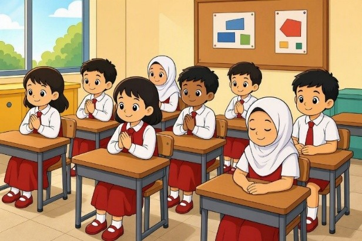
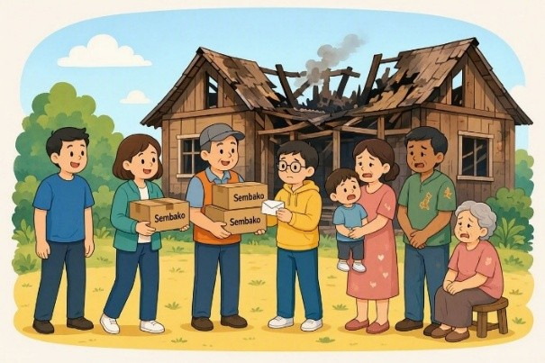
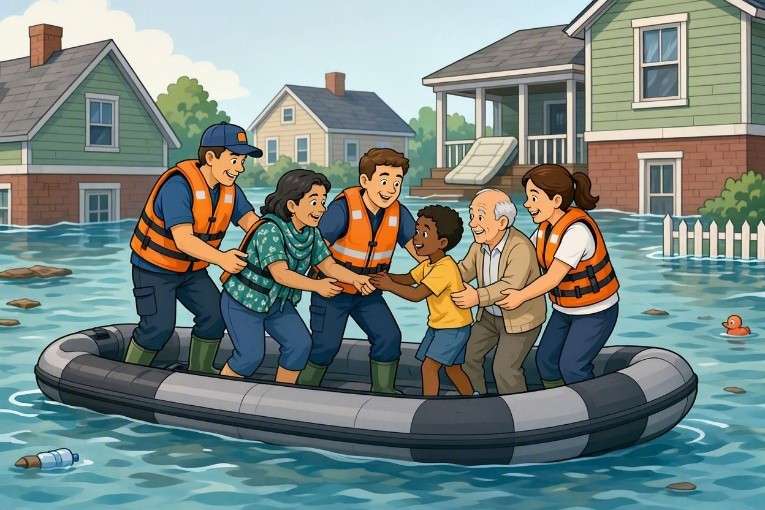
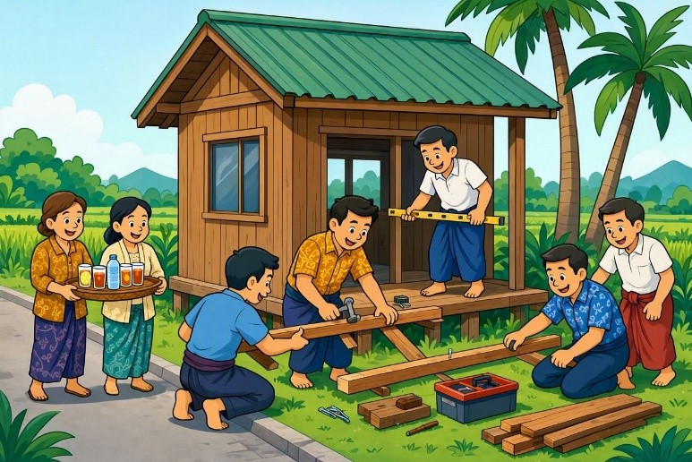

## 1. Pilihan Ganda

Pancasila terdiri dari lima sila yang saling berhubungan erat. Sila Pertama, yaitu Ketuhanan Yang Maha Esa, memiliki kedudukan yang sangat penting karena ....

- A. sebagai penengah antara sila kedua dan ketiga
- B. menjadi dasar yang menjiwai dan mendasari keempat sila lainnya
- C. berdiri sendiri tanpa hubungan dengan sila yang lain
- D. hanya berlaku untuk orang dewasa dan tokoh agama

Kunci: B
Skor: 1

## 2. Pilihan Ganda

Setiap pagi sebelum memulai pelajaran, seluruh siswa diwajibkan berdoa sesuai dengan keyakinan masing-masing. Kegiatan ini merupakan wujud pengamalan Sila ....

- A. Pertama
- B. Kedua
- C. Ketiga
- D. Keempat

Kunci: A
Skor: 1

## 3. Pilihan Ganda

Warga mengumpulkan dana secara sukarela untuk tetangga yang rumahnya terbakar demi meringankan beban dengan rasa persaudaraan. Tindakan ini menunjukkan keterkaitan antara Sila ....

- A. Pertama dan Kedua
- B. Kedua dan Keempat
- C. Ketiga dan Kelima
- D. Pertama dan Ketiga

Kunci: C
Skor: 1

## 4. Pilihan Ganda

Makna utama dari persatuan dalam keberagaman bagi bangsa Indonesia adalah ....

- A. menghapus semua perbedaan budaya dan bahasa daerah
- B. menjadikan suku bangsa terbanyak sebagai pemimpin mutlak
- C. menjaga keutuhan negara dari berbagai ancaman dan perpecahan
- D. memaksa seluruh warga mempelajari satu tarian daerah saja

Kunci: C
Skor: 1

## 5. Pilihan Ganda

Sila-sila dalam Pancasila dikatakan saling menjiwai. Hal ini berarti ....

- A. setiap sila dirumuskan pada waktu yang berbeda
- B. satu sila mengandung nilai dan roh dari sila-sila yang lain
- C. urutan sila boleh dibalik sesuai kebutuhan zaman
- D. sila yang satu lebih penting daripada sila yang lain

Kunci: B
Skor: 1

## 6. Pilihan Ganda

Ketika terjadi bencana alam, relawan menyelamatkan korban tanpa memandang suku, ras, atau agama. Tindakan tersebut paling tepat mencerminkan nilai ....

- A. ketuhanan yang kaku
- B. keadilan sosial yang menguntungkan sepihak
- C. kerakyatan yang dipimpin oleh hikmat
- D. kemanusiaan yang adil dan beradab

Kunci: D
Skor: 1

## 7. Pilihan Ganda

Sila yang berbunyi "Kemanusiaan yang adil dan beradab" dilambangkan dengan ....

- A. bintang emas
- B. rantai
- C. pohon beringin
- D. kepala banteng

Kunci: B
Skor: 1

## 8. Pilihan Ganda

Dalam rapat, Andi terus memaksa agar usulannya diterima dan memotong pembicaraan teman lain. Cara terbaik menyelesaikan hal ini sesuai Pancasila adalah ....

- A. meminta Andi keluar agar rapat bisa segera selesai
- B. membiarkan Andi berbicara sendiri sampai ia merasa lelah
- C. ketua rapat memberikan pengertian kepada Andi untuk menghargai mufakat
- D. guru langsung menunjuk siswa lain untuk menggantikan Andi

Kunci: C
Skor: 1

## 9. Pilihan Ganda

Perilaku yang sesuai dengan nilai-nilai kerakyatan pada Sila Keempat adalah ....

- A. melakukan pemungutan suara dengan jujur, adil, dan musyawarah
- B. menyelesaikan masalah dengan adu kekuatan otot
- C. memberikan keputusan tanpa meminta pendapat anggota
- D. menghindari musyawarah karena membuang-buang waktu

Kunci: A
Skor: 1

## 10. Pilihan Ganda

Hakim di pengadilan menjatuhkan hukuman yang setimpal kepada pelaku kejahatan tanpa memandang status sosialnya. Tindakan ini wujud hubungan antara Sila ....

- A. 1 dan 3
- B. 3 dan 4
- C. 4 dan 1
- D. 2 dan 5

Kunci: D
Skor: 1

## 11. Pilihan Ganda

Pancasila sebagai Dasar Negara berfungsi untuk ....

- A. menjadi pedoman pergaulan remaja sehari-hari
- B. mengatur seluruh tatanan penyelenggaraan pemerintahan negara
- C. menarik minat wisatawan asing untuk berkunjung
- D. menggantikan seluruh hukum adat yang ada di daerah

Kunci: B
Skor: 1

## 12. Pilihan Ganda

Segala macam undang-undang dan peraturan yang dibuat di Indonesia tidak boleh bertentangan dengan Pancasila karena Pancasila berkedudukan sebagai ....

- A. sumber dari segala sumber hukum
- B. pandangan hidup bangsa
- C. kepribadian bangsa
- D. semboyan negara

Kunci: A
Skor: 1

## 13. Pilihan Ganda

Perhatikan kegiatan berikut!
(1) Menengok teman yang sakit.
(2) Memakai produk sepatu dalam negeri.
(3) Berdoa sebelum makan siang.
(4) Bermusyawarah memilih ketua kelas.
Kegiatan yang merupakan pengamalan Sila Ketiga ditunjukkan oleh nomor ....

- A. (1)
- B. (2)
- C. (3)
- D. (4)

Kunci: B
Skor: 1

## 14. Pilihan Ganda

Apabila suatu negara tidak memiliki dasar negara yang disepakati bersama oleh seluruh rakyatnya, maka kemungkinan terbesar yang akan terjadi adalah ....

- A. negara tersebut akan semakin cepat kaya raya
- B. rakyatnya hidup sangat disiplin dan mandiri
- C. negara akan mudah hancur dan terpecah belah karena hilangnya pedoman
- D. wilayah negara tersebut akan meluas dengan sendirinya

Kunci: C
Skor: 1

## 15. Pilihan Ganda

Perundungan (bullying) fisik maupun verbal di sekolah sangat dilarang karena merendahkan martabat orang lain. Hal ini bertentangan dengan Pancasila Sila ....

- A. Pertama
- B. Kedua
- C. Ketiga
- D. Keempat

Kunci: B
Skor: 1

## 16. Pilihan Ganda

Pedoman perilaku dan sikap sehari-hari bagi seluruh masyarakat Indonesia dalam kehidupan bermasyarakat merupakan arti dari Pancasila sebagai ....

- A. dasar negara
- B. dasar hukum
- C. dokumen sejarah
- D. pandangan hidup bangsa

Kunci: D
Skor: 1

## 17. Pilihan Ganda

Contoh paling sederhana pengamalan Sila Pertama di lingkungan sekolah adalah ....

- A. berbagi makanan dengan teman sebangku
- B. saling menghormati saat teman sedang melaksanakan ibadah
- C. melaksanakan tugas piket dengan bersih
- D. ikut serta dalam lomba tarik tambang

Kunci: B
Skor: 1

## 18. Pilihan Ganda

Tokoh nasional yang menyampaikan pidato rumusan dasar negara dan mengusulkan nama "Pancasila" pada 1 Juni 1945 adalah ....

- A. Drs. Mohammad Hatta
- B. Ir. Soekarno
- C. Mr. Mohammad Yamin
- D. Ki Hajar Dewantara

Kunci: A
Skor: 1

## 19. Pilihan Ganda

Pembagian tugas menyapu dan mengepel di dalam kelas harus dilakukan secara ....

- A. merata sesuai kesepakatan agar adil
- B. diserahkan hanya kepada siswa perempuan
- C. dibebankan kepada siswa yang sering terlambat
- D. diberikan kepada siswa yang paling pintar di kelas

Kunci: A
Skor: 1

## 20. Pilihan Ganda

Perbedaan utama antara dasar negara dan pandangan hidup bangsa terletak pada ....

- A. dasar negara dibuat oleh presiden, pandangan hidup dibuat oleh rakyat
- B. dasar negara hanya berlaku di kota, pandangan hidup berlaku di desa
- C. dasar negara untuk orang dewasa, pandangan hidup untuk anak-anak
- D. dasar negara mengatur ketatanegaraan/hukum, pandangan hidup mengatur pedoman moral warga

Kunci: D
Skor: 1

## 21. Pilihan Ganda

Manfaat utama dari kegiatan gotong royong warga adalah ....

- A. mendapatkan upah yang besar dari pemerintah
- B. pekerjaan cepat selesai dan memupuk rasa persaudaraan warga
- C. menunjukkan kehebatan fisik warga kepada desa lain
- D. menghindari hukuman denda yang ditetapkan desa

Kunci: B
Skor: 1

## 22. Pilihan Ganda

Kewajiban utama seorang murid di lingkungan sekolah adalah ....

- A. mematuhi tata tertib dan menghormati guru
- B. mendapatkan nilai sempurna tanpa perlu belajar
- C. menggunakan fasilitas sekolah untuk bermain bebas
- D. menuntut guru agar tidak memberikan PR

Kunci: A
Skor: 1

## 23. Pilihan Ganda

Jika masyarakat menolak untuk bertoleransi dan sering mengejek tradisi suku lain, akar masalah yang akan timbul di kemudian hari adalah ....

- A. ekonomi masyarakat akan tumbuh pesat
- B. budaya asing akan masuk dengan sangat mudah
- C. setiap orang akan hidup lebih mandiri dan kuat
- D. hilangnya rasa persatuan yang berujung pada konflik dan perpecahan

Kunci: D
Skor: 1

## 24. Pilihan Ganda

Sikap yang tepat saat melihat teman beragama lain merayakan hari besar keagamaannya adalah ....

- A. mengucapkan selamat dan menghargai perayaannya
- B. melarangnya merayakan di dekat rumah kita
- C. ikut campur mengatur tata cara ibadahnya
- D. menutup pintu rumah rapat-rapat dan membunyikan musik keras

Kunci: A
Skor: 1

## 25. Pilihan Ganda

Seorang remaja merasa malu menggunakan pakaian batik dan lebih memilih pakaian impor agar terlihat modern. Sikap tersebut kurang tepat karena ....

- A. batik memiliki harga jual yang jauh lebih mahal
- B. pakaian impor lebih mudah sobek
- C. tidak mencerminkan sikap bangga dan cinta terhadap produk budaya bangsa
- D. remaja tersebut belum bisa menjahit sendiri

Kunci: C
Skor: 1

## 26. Pilihan Ganda

Budi bertugas mengunci pintu kelas, tetapi ia lalai dan langsung pulang. Akibat dari melalaikan tanggung jawab tersebut adalah ....

- A. kelas menjadi lebih sejuk di malam hari
- B. Budi akan mendapatkan hadiah keberanian dari sekolah
- C. penjaga sekolah tidak perlu lagi berpatroli
- D. barang-barang inventaris di dalam kelas rawan hilang dicuri

Kunci: D
Skor: 1

## 27. Pilihan Ganda

Warga melakukan pemilihan ketua RT dengan cara warga memilih langsung dan memasukkan surat suara ke dalam kotak yang tertutup. Asas yang tercermin dalam pemilu tersebut adalah ....

- A. bebas dan rahasia
- B. jujur dan dipaksakan
- C. terbuka dan umum
- D. adil dan sewenang-wenang

Kunci: A
Skor: 1

## 28. Pilihan Ganda

Semboyan pemersatu bangsa Indonesia yang tercengkeram pada kaki burung Garuda adalah ....

- A. Tut Wuri Handayani
- B. Kartika Eka Paksi
- C. Jalesveva Jayamahe
- D. Bhinneka Tunggal Ika

Kunci: D
Skor: 1

## 29. Pilihan Ganda

Dalam sebuah diskusi, Doni ingin menyanggah pendapat Rina. Kalimat sanggahan yang paling santun dan sesuai nilai demokrasi adalah ....

- A. "Pendapatmu itu sangat kuno, jangan dipakai!"
- B. "Saya sama sekali tidak setuju dengan pikiranmu yang aneh itu."
- C. "Maaf Rina, menurut saya usulan itu baik, namun alangkah baiknya jika ...."
- D. "Terserah kamu saja, tapi saya tidak mau ikut campur lagi."

Kunci: C
Skor: 1

## 30. Pilihan Ganda

Dina ketahuan mencoret-coret tembok sekolah yang baru dicat. Sanksi logis dan mendidik yang harus diberikan kepadanya adalah ....

- A. dikeluarkan dari sekolah hari itu juga
- B. dipukuli tangannya menggunakan penggaris kayu
- C. membersihkan dan mengecat kembali tembok yang dicoretnya
- D. disita tas dan buku pelajarannya secara permanen

Kunci: C
Skor: 1

## 31. Esai

Pancasila merupakan satu kesatuan yang bulat dan utuh. Sebutkan 3 (tiga) ciri Pancasila sebagai satu kesatuan yang tidak dapat dipisahkan!

Skor: 10

## 32. Esai

Kelima sila dalam Pancasila saling berhubungan dan tidak bisa dipisahkan. Jelaskan apa maksud dari pernyataan bahwa "Sila Pertama menjiwai sila-sila yang lainnya"!

Skor: 10

## 33. Esai

Kemanusiaan yang adil dan beradab harus dilandasi oleh nilai Ketuhanan. Uraikan secara logis bagaimana hubungan antara Sila Pertama dan Sila Kedua Pancasila!

Skor: 10

## 34. Esai

Jelaskan makna dari kedudukan Pancasila sebagai "Dasar Negara" bagi penyelenggaraan pemerintahan di Indonesia!

Skor: 10

## 35. Esai

Tuliskan 2 (dua) contoh tindakan nyata pengamalan Sila Ketiga (Persatuan Indonesia) di lingkungan sekolah!

Skor: 10

## 36. Esai

Ruang kelas tampak sangat kotor setelah jam prakarya, sementara petugas piket hari itu hanya dua orang. Bagaimana cara menyelesaikan masalah ini berdasarkan nilai gotong royong agar adil dan efisien?

Skor: 10

## 37. Esai

Jelaskan secara singkat perbedaan fungsi Pancasila sebagai dasar negara dengan Pancasila sebagai pandangan hidup bangsa!

Skor: 10

## 38. Esai

Saat pemilihan ketua kelas, hasil voting menunjukkan Rian menang beda satu suara atas Dimas. Dimas tidak terima dan ingin melakukan pemilihan ulang. Sebagai warga kelas, rancanglah langkah-langkah memecahkan masalah ini dengan menjunjung tinggi nilai musyawarah mufakat!

Skor: 10

## 39. Esai

Buatlah rancangan pembagian tugas piket harian di kelasmu yang mencerminkan nilai Sila Kelima Pancasila (Keadilan Sosial bagi Seluruh Rakyat Indonesia)!

Skor: 10

## 40. Esai

Terjadi perselisihan antarpelajar yang disebabkan oleh saling ejek suku bangsa di media sosial. Rancanglah 3 (tiga) tindakan penyelesaian dan perdamaian yang sesuai dengan nilai-nilai Pancasila untuk mengatasi konflik tersebut!

Skor: 10

