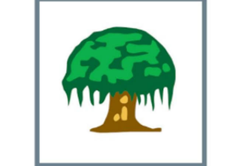
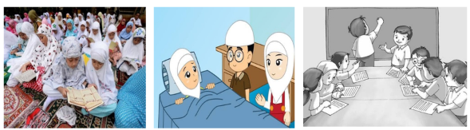

## 1. Pilihan Ganda

Pancasila merupakan dasar negara bagi ....

- A. indonesia
- B. malaysia
- C. singapura
- D. thailand

Kunci: A
Skor: 1

## 2. Pilihan Ganda

Lambang sila kedua Pancasila adalah ....

- A. bintang
- B. pohon beringin
- C. rantai
- D. kepala banteng

Kunci: C
Skor: 1

## 3. Pilihan Ganda

Rudi selalu berlaku adil, jujur, dan suka menolong siapa pun karena ia yakin tuhan menilai setiap perbuatannya. Sikap Rudi menunjukan bahwa sila yang menjadi dasar dan menjiwai pengamalan sila-sila lainnya adalah ....

- A. ketuhanan Yang Maha Esa
- B. kemanusiaan yang adil dan beradab
- C. Persatuan Indonesia
- D. keadilan sosial bagi seluruh rakyat indonesia

Kunci: A
Skor: 1

## 4. Pilihan Ganda

Sikap yang sesuai dengan sila kedua adalah ....

- A. membeda-bedakan teman
- B. menghargai dan menolong sesama
- C. memaksakan kehendak
- D. mementingkan diri sendiri

Kunci: B
Skor: 1

## 5. Pilihan Ganda

Menjaga persatuan walaupun memiliki perbedaan suku dan budaya merupakan pengamalan sila ....

- A. pertama
- B. kedua
- C. ketiga
- D. kelima

Kunci: C
Skor: 1

## 6. Pilihan Ganda

Musyawarah untuk mencapai mufakat merupakan pengamalan sila ....

- A. kedua
- B. ketiga
- C. keempat
- D. kelima

Kunci: C
Skor: 1

## 7. Pilihan Ganda

Bersikap adil kepada semua teman merupakan contoh pengamalan sila ....

- A. pertama
- B. kedua
- C. keempat
- D. kelima

Kunci: B
Skor: 1

## 8. Pilihan Ganda

Salah satu contoh kontribusi nyata menerapkan sila Keadilan Sosial Bagi Seluruh Rakyat Indonesia yaitu….

- A. menegakkan hukum yang adil dan transparan
- B. memelihara kesatuan dan persatuan bangsa
- C. mempertahankan kedaulatan bangsa
- D. meningkatkan keragaman bangsa

Kunci: A
Skor: 1

## 9. Pilihan Ganda

Sebagai seorang pelajar kewajiban kita terhadap Pancasila adalah ….

- A. menghafalkan sila-silanya saja
- B. mempelajari Sejarah lahirnya Pancasila
- C. mengamalkan nilai-nilai pancasila dalam kehidupan sehari-hari
- D. mengabaikan nilai-nilai pancasila

Kunci: C
Skor: 1

## 10. Pilihan Ganda

Sila yang terkandung pada lagu “Dari Sabang Sampai Merauke” yaitu sila ke-….

- A. kesatu
- B. kedua
- C. ketiga
- D. keempat

Kunci: C
Skor: 1

## 11. Pilihan Ganda

Sila Ketuhanan Yang Maha Esa mengajarkan kita untuk….

- A. menghargai semua agama
- B. mengabaikan agama
- C. menyebarluaskan agama
- D. menentukan agama negara

Kunci: A
Skor: 1

## 12. Pilihan Ganda

Maksud dari Pancasila sebagai dasar negara adalah….

- A. dasar untuk merancang undang-undang
- B. prinsip hidup individual atau perorangan
- C. ideologi yang digunakan dalam pemerintahan
- D. pandangan hidup bangsa yang diterapkan dalam kehidupan sehari-hari

Kunci: D
Skor: 1

## 13. Pilihan Ganda

Sikap menghargai perbedaan pendapat hendaknya dilakukan agar tercipta ….

- A. rasa memaksakan kehendak kepada orang lain
- B. hubungan Masyarakat yang rukun dan damai
- C. suasana perdebatan yang semakin meruncing
- D. perselisihan yang lebih besar

Kunci: B
Skor: 1

## 14. Pilihan Ganda

Kita harus…mempunyai Dasar Negara yang kuat yaitu Pancasila.

- A. menghargai
- B. malu
- C. sedih
- D. bangga

Kunci: D
Skor: 1

## 15. Pilihan Ganda

Upaya nyata seorang pelajar dalam menghormati semangat dan nilai-nilai kebersamaan dalam merumuskan Pancasila Adalah sebagai berikut, kecuali….

- A. semena-mena terhadap orang lain
- B. belajar dengan rajin
- C. tidak memaksakan kehendak kepada orang lain
- D. saling menghormati perbedaan

Kunci: A
Skor: 1

## 16. Pilihan Ganda

Tanggal 1 juni diperingati sebagai….

- A. hari lahir piagam Jakarta
- B. hari lahir Pancasila
- C. hari kartini
- D. hari proklamasi

Kunci: B
Skor: 1

## 17. Pilihan Ganda

Indonesia merupakan negara yang kaya akan keberagaman. Dalam upaya mempersatukan keberagaman tersebut, para tokoh perumus dasar negara menerapkan sikap….

- A. menghargai satu sama lain
- B. mementingkan kepentingan golongan
- C. memaksakan pendapatannya sebagai keputusan akhir
- D. suka mengintimidasi golongan minoritas

Kunci: A
Skor: 1

## 18. Pilihan Ganda

Memberikan kesempatan kepada rakyat untuk mengajukan saran dan kritik dalam hal pelaksanaan pembangunan yang dilakukan pemerintah merupakan contoh pengamalan sila…

- A. kemanusian yang adil dan beradab
- B. persatuan Indonesia
- C. kerakyatan yang dipimpin oleh hikmat kebijaksanaan dalam permusyawaratan /perwakilan
- D. keadilan sosial bagi seluruh rakyat indonesua

Kunci: C
Skor: 1

## 19. Pilihan Ganda

Sila pertama Pancasila, Ketuhanan Yang Maha Esa, memiliki kedudukan yang sangat penting dalam struktur Pancasila, yaitu sebagai….

- A. sila yang berdiri tanpa hubungan dengan sila lain
- B. sila pelengkap yang hanya dilaksanakan saat beribadah
- C. dasar yang menjiwai dan memimpin pelaksanaan sila kedua sampai kelima
- D. sila yang hanya berlaku untuk kelompok agama mayoritas

Kunci: C
Skor: 1

## 20. Pilihan Ganda

Penerapan sikap yang sesuai dengan lambang Pancasila di samping Adalah….

- A. menolong dengan terpaksa
- B. mengikuti pelaksanaan ibadah
- C. berteman dengan siapa saja ,walaupun berbeda suku bangsa
- D. membantu ibu Ketika disuruh

Kunci: C
Skor: 1

## 21. Pilihan Ganda

Perhatikan dua pernyataan berikut ! Pernyataan 1 : Rina langsung membagikan berita kepada teman-temannya tanpa memastikan kebenarannya. Pernyataan 2 : Dimas memeriksa kebenaran sumber berita terlebih dahulu sebelum membagikannya . Akibat yang paling mungkin terjadi dari sikap pada pernyataan ke 1 adalah….

- A. informasi menjadi lebih akurat
- B. muncul kesalahpahaman atau perpecahan
- C. persatuan antarwarga semakin kuat
- D. semua orang percaya berita tersebut benar

Kunci: B
Skor: 1

## 22. Pilihan Ganda

Amatilah gambar! Urutan nilai Pancasila yang tercermin dari ketiga kegiatan tersebut secara berturut-turut Adalah….

- A. Ketuhanan, kemanusiaan, kerakyatan
- B. Kemanusiaan, ketuhanan, keadilan
- C. ketuhanan, persatuan, keadilan
- D. kerakyatan, kemanusiaan, ketuhanan

Kunci: A
Skor: 1

## 23. Pilihan Ganda

Rumusan Pancasila pertama kali diusulkan pada sidang…

- A. PPPKI
- B. BPUPKI
- C. PPKI
- D. BPPUPKI

Kunci: B
Skor: 1

## 24. Pilihan Ganda

Sekelompok siswa memilih ketua kelas berdasarkan hasil musyawarah seluruh anggota kelas, bukan berdasarkan keinginan pribadi salah satu siswa .Sikap tersebut mencerminkan penerapan dua nilai Pancasila sekaligus,yaitu….

- A. ketuhanan dan persatuan
- B. kerakyatan dan keadilan
- C. kemanusiaan dan ketuhanan
- D. persatuan dan keadilan

Kunci: D
Skor: 1

## 25. Pilihan Ganda

Undang-Undang Dasar 1945 disahkan sebagai dasar negara dan konstitusi tertulis oleh PPKI pada tanggal….

- A. 17 Agustus 1945
- B. 18 Agustus 1945
- C. 1 Juni 1945
- D. 22 Juni 1945

Kunci: B
Skor: 1

## 26. Pilihan Ganda

Rafi berprestasi dalam bidang sains, namun ia berasal dari keluarga kurang mampu. pemerintah memberikan beasiswa agar ia dapat melanjutkan pendidikan ke jenjang yang lebih tinggi. Hak warga negara yang terpenuhi pada kasus tersebut Adalah….

- A. hak atas pekerjaan
- B. hak atas Pendidikan
- C. hak atas kebebasan berpendapat
- D. hak atas perlindungan hukum

Kunci: B
Skor: 1

## 27. Pilihan Ganda

Sebagai seorang siswa, kita memiliki kewajiban untuk menghormati guru. Tindakan yang menunjukan penghormatan kepada guru adalah....

- A. berbicara kasar kepada guru
- B. mengganggu teman saat guru sedang menjelaskan
- C. mendengarkan dengan baik saat guru menjelaskan
- D. tidak mengerjakan tugas yang diberikan

Kunci: C
Skor: 1

## 28. Pilihan Ganda

Sikap positif terhadap UUD 1945 di lingkungan sekolah dapat diwujudkan dengan cara….

- A. datang ke sekolah sesuka hati
- B. mematuhi tata tertib sekolah
- C. memilih teman yang kaya saja
- D. tidur saat jam Pelajaran

Kunci: B
Skor: 1

## 29. Pilihan Ganda

Ketika terjadi perbedaan pendapat dalam memilih tujuan wisata kelas, seluruh siswa berdiskusi dengan tertib. Setelah dilakukan musyawarah, mereka menerima hasil keputusan bersama walaupun pilihan pribadinya berbeda. Sikap tersebut menunjukan….

- A. memaksakan kehendak
- B. mengutamakan kepentingan pribadi
- C. menghargai hasil musyawarah
- D. menghindari tanggung jawab

Kunci: C
Skor: 1

## 30. Pilihan Ganda

Perhatikan data berikut!  
Sila kesatu : Berdoa sebelum belajar  
Sila kedua : Menghormati pendapat teman  
Sila ketiga : ….  
Sila keempat : Bermusyawarah menentukan ketua kelas

  
Sikap yang tepat untuk melengkapi pada sila ketiga adalah….

- A. membagi tugas piket secara adil
- B. menjaga kerukunan meskipun berbeda suku
- C. menyontek saat ujian
- D. bermain sendiri tanpa mengajak teman

Kunci: B
Skor: 1

## 31. Esai

Pancasila berasal dari bahasa….

Skor: 10

## 32. Esai

Pancasila merupakan…negara Indonesia

Skor: 10

## 33. Esai

Musyawarah mufakat adalah cara mengambil keputusan yang mengutamakan….

Skor: 10

## 34. Esai

Berikan 3 contoh pengamalan nilai-nilai kemanusiaan yang adil dan beradab di lingkungan sekolah!

Skor: 10

## 35. Esai

Apa yang dimaksud dengan gotong royong dan mengapa gotong royong penting dalam kehidupan Masyarakat….

Skor: 10

## 36. Esai

Cara pengambilan keputusan untuk memecahkan masalah yang terbaik dilakukan dengan cara….

Skor: 10

## 37. Esai

Menjaga keseimbangan antara hak dan kewajiban merupakan pengamalan Pancasila sila ke-….

Skor: 10

## 38. Esai

Pancasila sebagai dasar negara tercantum dalam Pembukaan Undang-Undang Dasar Negara Republik Indonesia Tahun 1945 alinea ke-….

Skor: 10

## 39. Esai

Sila Ketuhanan Yang Maha Esa mengajarkan bahwa kebebasan beragama di Indonesia meliputi beribadah serta taat terhadap agama yang dianut ,tanpa adanya … dari orang lain.

Skor: 10

## 40. Esai

Indonesia memiliki masyarakat yang beragam .Menurut pendapatmu,apa yang akan terjadi apabila masyarakat tidak mengamalkan nilai persatuan?

Skor: 10

